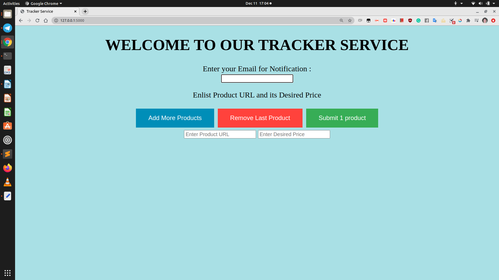
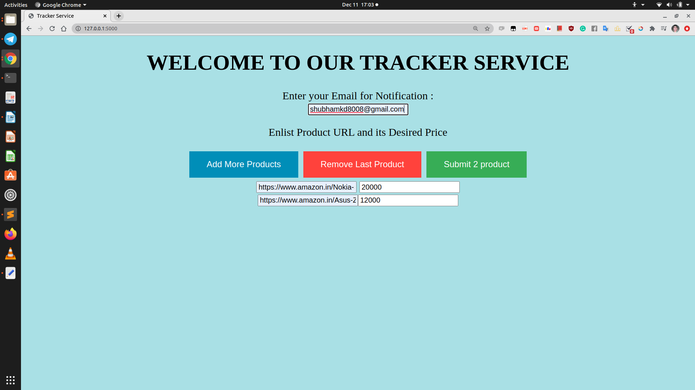
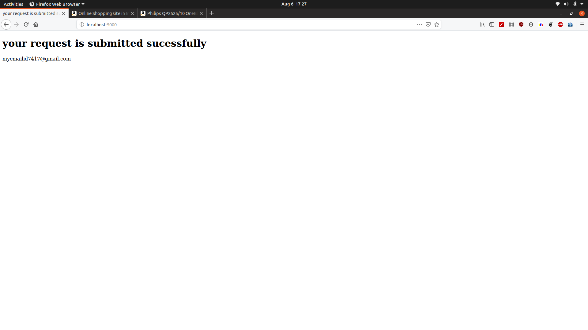
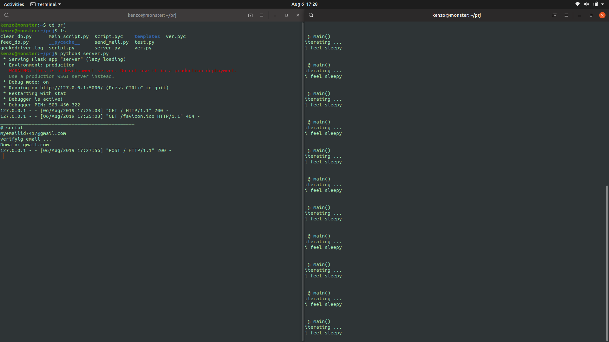
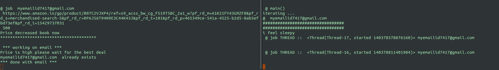

# Amazon_Product_Tracker

A web application that track Amazon Products and their availability repetitively until its price comes under given desired price and then
notifies user with an email implemented using Web Scraping.

## Requirements:
 * Flask
 * Python3
 * Requests
 * BeautifulSoup
 * Selenium
 
 ## Working of Program is Shown with Images
 ### User Interface

 ### Entries Being Filled

 ### Successfull submission 

 ### Initial condition of SERVER and SCRIPT

 ### For First product Email is sent to the USER

 ### ONE URL stored in DATABASE since price is greater than Desired Price

