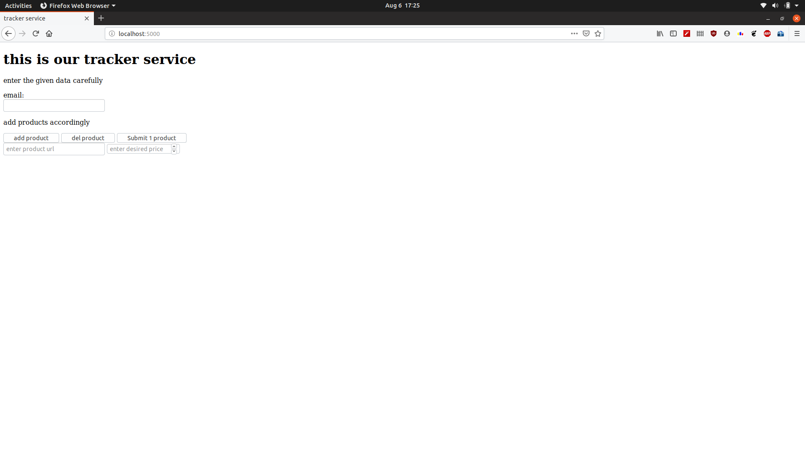
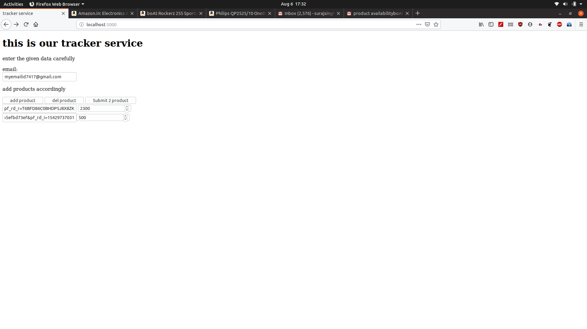
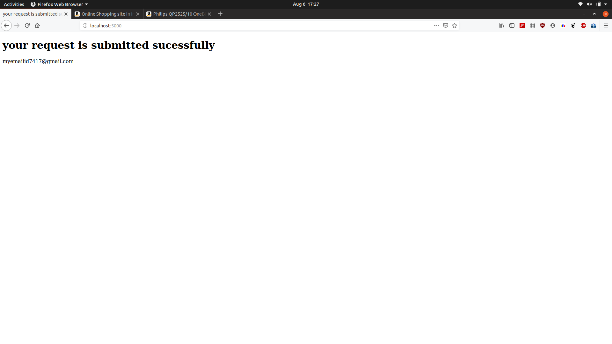
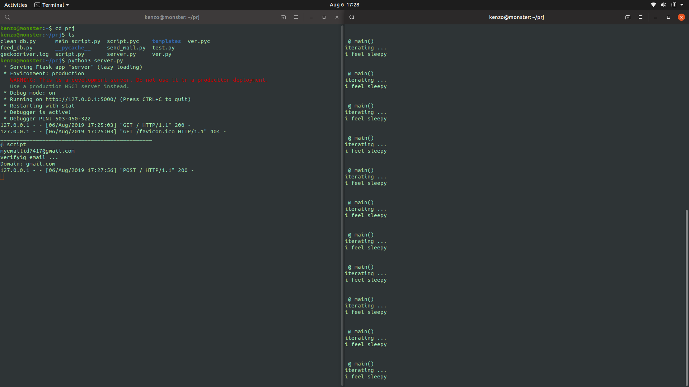
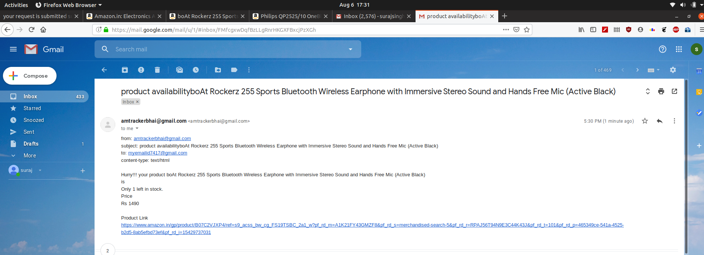
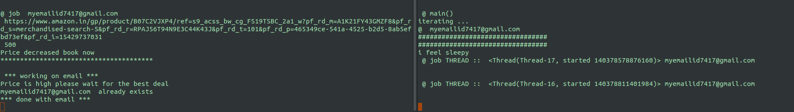

# Amazon_Product_Tracker

This Python program track Amazon Products and their availability repetitively until its price comes under given desired price and then
notifies user with an email implemented using Web Scrapping and Multi-threading.

## Requirements:
 * Flask
 * Mongodb
 * Python3
 * Requests
 * BeautifulSoup
 
 ## Working of Program is Shown with Images
 ### User Interface

 ### Entries Being Filled

 ### Successfull submission 

 ### Initial condition of SERVER and SCRIPT

 ### For First product Email is sent to the USER

 ### ONE URL stored in DATABASE since price is greater than Desired Price

